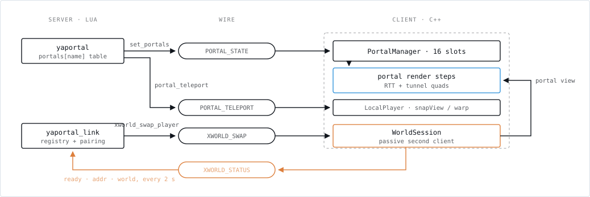
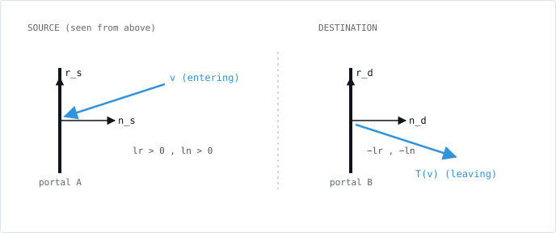
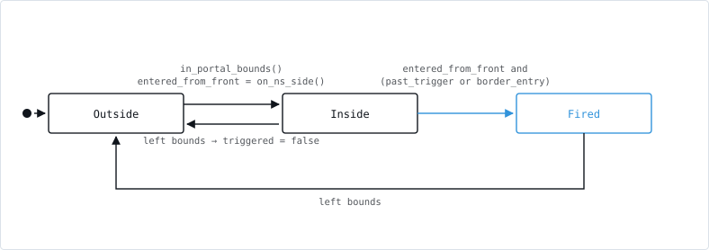
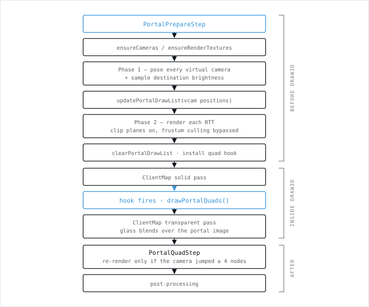
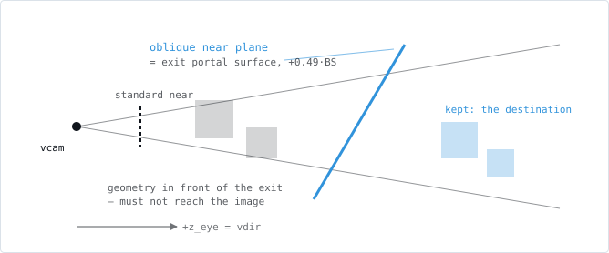
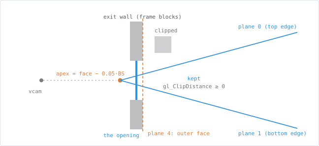
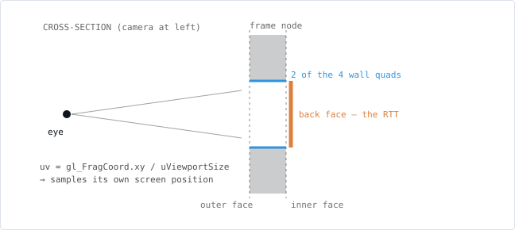
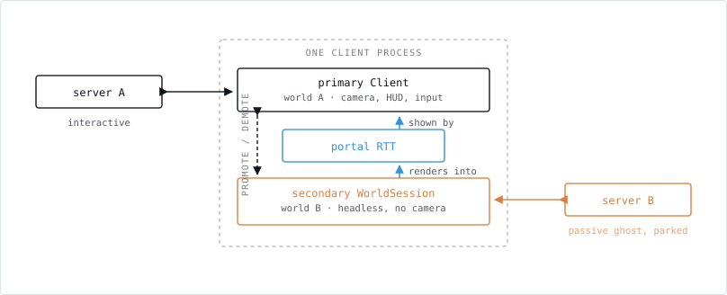
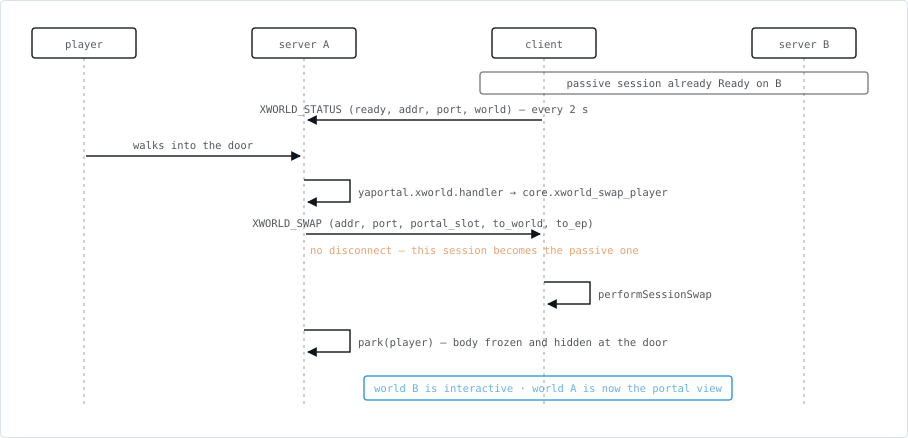

# The portal system

How Luanti-portal works: the geometry and mathematics of a portal, the frame-by-frame
rendering method, the cross-world dual-client, and every change made to the Luanti engine
with the reason it was needed.

This is the *explanation*. `AGENTS.MD` is the build recipe plus the list of invariants
("break one and a past bug comes back"); `README.md` is the user manual. Where this
document and a code comment disagree, the code wins — and the disagreement is a bug
report.

**Two editions, same content.** This file is canonical — edit it first.
[`portal-system.html`](portal-system.html) next to it is the typeset edition: identical
text and identical figures, laid out as a single self-contained page (no scripts, no fonts,
no external requests) that opens straight from a checkout.

The nine drawings live once, in [`figures/`](figures/), as standalone SVGs that carry their
own light/dark palette; this file references them as images and the HTML inlines the same
markup. **Change a drawing in `figures/` and paste it into the HTML too** — there is no
build step, and nothing checks that the two stay in step.

**Baseline.** The engine is a fork of [luanti-org/luanti](https://github.com/luanti-org/luanti)
at tag **5.16.1**, tracked as the `luanti_src/` submodule on branch `portal-fork`:
**29 commits, 77 files changed, +6369 / −309 lines**.

---

## Contents

- [0. Architecture](#0-architecture)
- [1. Portal geometry and the transform](#1-portal-geometry-and-the-transform)
- [2. Trigger and traversal](#2-trigger-and-traversal)
- [3. Rendering](#3-rendering)
- [4. Client-side motion and camera](#4-client-side-motion-and-camera)
- [5. Node types and world representation](#5-node-types-and-world-representation)
- [6. Cross-world doors (dual client)](#6-cross-world-doors-dual-client)
- [7. Catalogue of engine modifications](#7-catalogue-of-engine-modifications)
- [8. Invariants and failure modes](#8-invariants-and-failure-modes)
- [9. Diagnostics and testing](#9-diagnostics-and-testing)
- [Appendix A — constants](#appendix-a--constants)
- [Appendix B — Lua API added by the fork](#appendix-b--lua-api-added-by-the-fork)
- [Appendix C — protocol messages](#appendix-c--protocol-messages)

---

## 0. Architecture

A portal is one object described in three places at once, and most of the system's
complexity is keeping those three descriptions in agreement.

| Layer | Owns | Lives in |
|---|---|---|
| **Mod (Lua, server side)** | What a portal *is*: where its frame stands, which portal it leads to, when a player has crossed it, where they come out. | `yaportal/init.lua` (6747 lines), `yaportal_link/init.lua` (2221 lines) |
| **Engine (C++, client side)** | What a portal *looks like*: a render-to-texture pass from a mirrored camera, drawn onto five faces of a tunnel. | `src/portal_manager.*`, `src/client/render/portal.*`, `src/client/worldsession.*` |
| **Protocol** | Getting the first to the second when they are not the same process. | four `TOCLIENT` and one `TOSERVER` message |



***The portal is decided in Lua and drawn in C++.** In a local singleplayer world those are the same process; for any other world these messages are the only thing holding the two halves together. Only the passive `WorldSession` talks back.*

### Components

- **`yaportal/`** — the play portals: frames, portal guns, pocket dimensions, floor and
  ceiling portals, the Portal-1 puzzle blocks. Everything here is single-world.
- **`yaportal_link/`** — cross-world doors. A trusted mod: it launches other worlds'
  servers and reads/writes a shared registry directory.
- **`yafps/`** — a minimal FPS arena game, shipped as a *different game* to walk into,
  which is what forces the cross-game media rules of §6.
- **`luanti_src/`** — the engine fork.

### Why the engine had to be forked

Everything below is invisible to a Lua mod in stock Luanti. Each one is load-bearing:

1. **Rendering the world from a second camera pose into a texture.** No Lua API exposes
   the scene manager, a render target, or a camera.
2. **An oblique near clip plane.** Without it the geometry between the destination portal
   and the destination camera appears in the portal image.
3. **Per-vertex clip distances.** The oblique plane alone leaks the destination frame at
   grazing angles.
4. **Atomic teleport.** `set_pos` + `set_look_*` + `add_velocity` are three packets: the
   client shows a torn frame between them. The portal illusion dies there.
5. **Camera roll.** Luanti has no roll; a horizontal↔vertical traversal needs one.
6. **A collision-box shift**, so a player can sink through a floor portal past the block
   that holds the frame up.
7. **A second live connection** to another server, rendered into the portal, and promoted
   in place when the player walks through.

---

## 1. Portal geometry and the transform

Source: `yaportal/init.lua:236-432`.

### 1.1 Representation

```lua
portals[name] = {
  cx, cy, cz,     -- integer node coords of the opening's low corner
  axis,           -- 0 = opening in the XY plane (normal ±Z)
                  -- 1 = opening in the YZ plane (normal ±X)
                  -- 2 = horizontal, opening in the XZ plane (normal ±Y)
  ns,             -- normal sign, +1 / -1: which side is the "front"
  w, h,           -- opening size in nodes (1..8 wide, 2..8 tall for frames)
  rot,            -- 0..3, quarter turns of the in-plane basis about the normal
  ou, ov,         -- optional half-node offsets of the opening (wall-carved portals)
  kind,           -- nil = frame portal (type 1), "block" = hollow block (type 2)
  link,           -- name of the destination portal, or nil
  xworld,         -- {world=, ep=, addr=, port=} for a cross-world door
  node_name,      -- frame material
}
```

`ns` is chosen once, at activation, from which side of the plane the player stood on
(`normal_sign`). It is what makes a portal one-directional.

`inner_center(pp)` returns the centre of the opening in world coordinates — the point
everything else is measured from. For `axis == 0` that is
`{cx + (w-1)/2 + ou, cy + (h-1)/2 + ov, cz}`.

### 1.2 The portal frame (basis)

Each portal carries an orthonormal triad **(n, r, u)** — normal, right, up:

```lua
axis 0:  n = (0,0,ns)   r = (-ns,0,0)  u = (0,1,0)
axis 1:  n = (ns,0,0)   r = (0,0,ns)   u = (0,1,0)
axis 2:  n = (0,ns,0)   r = (1,0,0)    u = (0,0,1)
```

then `apply_rot(r, u, rot)` turns the in-plane pair by `rot` quarter-turns
(`r' = u`, `u' = -r` per step). The C++ side derives the same triad with
`right_of(p) = normal × up` (`portal.cpp:33`) — identical by construction, and it must
stay identical: the mod and the renderer both compute the transform independently.

Note that **(r, u, n) is left-handed** (`r × u = -n`). That matters in §1.3.

### 1.3 The transform

Write `B_s = [r_s u_s n_s]` and `B_d = [r_d u_d n_d]` as the two frames' column matrices.
`portal_transform_pos` and `portal_transform_dir` compute

```
        ⎡ lr ⎤   ⎡ v·r_s ⎤                    ⎡ −lr ⎤
  v  ↦  ⎢ lu ⎥ = ⎢ v·u_s ⎥   then   out = B_d ⎢ +lu ⎥
        ⎣ ln ⎦   ⎣ v·n_s ⎦                    ⎣ −ln ⎦
```

i.e. **T = B_d · M · B_sᵀ** with **M = diag(−1, +1, −1)**.



***The transform is a rotation, not a mirror.** The right and normal components both flip;
up is carried through. Because both frames are left-handed,
`det T = (−1)(+1)/(−1) = +1` — a proper rotation, so writing does not come out backwards
and the player's left hand stays their left hand.*

In the (r, u, n) frame `M` is a **180° rotation about the portal's up axis**. Because both
frames are left-handed, `det T = det(B_d) · det(M) / det(B_s) = (−1)(+1)/(−1) = +1` — a
proper rotation. That is the requirement: a portal must not mirror the world, or writing
would come out backwards and the player's left hand would become their right.

Intuition: you enter the front of A heading `−n_s`, you leave the front of B heading
`+n_d`. The normal component flips, the in-plane right component flips with it (they
belong to the same rotation), the up component is carried through.

Two details in `portal_transform_pos` that `portal_transform_dir` does not have:

- **The depth clamp** (`init.lua:411-415`): `dst_ln` is pushed to at least ±0.02 away from
  zero. A traversal computed exactly on the destination plane leaves the player at depth 0,
  which is simultaneously "inside" and "outside" the destination portal — the trigger test
  of §2 then fires again and the player ping-pongs.
- Positions are transformed **relative to `inner_center`**, directions are not.

#### The horizontal-portal exception

```lua
local eff_src_r = (src.axis == 2 or dst.axis == 2)
    and {x=-src_r.x, y=-src_r.y, z=-src_r.z} or src_r
```

Whenever **either** end is horizontal, `src_r` is negated before the transform. Since the
transform then negates the resulting coefficient again, the effective map becomes
**diag(+1, +1, −1)** in the original bases: only the normal component flips.

This rule applies to **everything** the body carries — position, look direction,
velocity, world-up (for the roll), entity rotation — and it is computed once per traversal
and reused. Deriving it per quantity, or using a separate "no-swap factor", has been tried
and produces poses that disagree between position and look.

Two consequences worth knowing before touching either side:

- `det(diag(+1,+1,−1)) = −1`. For traversals involving a horizontal portal the *body*
  transform is a reflection, not a rotation. In practice it lands as a different exit yaw,
  which the roll-settling animation of §1.5 absorbs; horizontal portals are treated as
  "turn me over", not "mirror me".
- The **renderer never applies this exception**. `setVirtualCamera` (`portal.cpp:110-122`)
  always uses the rotation form. `Game::performSessionSwap` *does* apply it
  (`game.cpp:756`), under the name `rotate_only`, precisely so the client's arrival
  prediction matches what the exit server will compute.

### 1.4 Yaw and pitch

Luanti's `get_look_dir()` goes through `getRadYawDep()`, which is
`(m_rotation.Y + 90°) × DEGTORAD`. The consequence is a sign that catches everyone:

```lua
new_yaw = math.atan2(-new_look.x, new_look.z)   -- NOT atan2(x, z)
new_pitch = -math.asin(clamp(new_look.y, -1, 1))
```

**Gimbal-lock fallback** (`init.lua:1434-1449`): when the transformed look is within 0.01
of vertical, its horizontal projection carries no yaw information. The mod then transforms
a *horizontal right vector* derived from the original look (or from `get_look_yaw()` when
the pitch is exactly ±90°) and reads the yaw off that instead:
`new_yaw = atan2(rt.z, rt.x)`.

### 1.5 Roll

A traversal between portals with different bases leaves the horizon tilted. The mod
measures that tilt exactly (`init.lua:1456-1483`):

1. Transform world-up through the portal: `nwu = T(0,1,0)`.
2. Project both world-up and `nwu` onto the plane perpendicular to `new_look`.
3. `roll = ±acos(ĉu0 · ŝup)`, sign from `sign(cross(cu0, sup) · new_look)`.

The teleport packet carries this roll, and the client *starts* rolled by it. A
globalstep then animates `roll → 0` over roughly `|roll| / π` seconds, so the player is
briefly disoriented and then settles upright — the Portal-style landing, rather than an
instant snap or a permanently tilted horizon.

### 1.6 Velocity

`new_vel = T_dir(vel)`, but the packet carries **`new_vel − vel`**, a delta.
`PlayerSAO::setMaxSpeedOverride` and the client's `addVelocity` both work in deltas; an
absolute velocity would be overwritten by whatever the client's own physics computed for
the same frame.

### 1.7 Exit placement

The exit is computed for the **eye**, not the feet, so that what the player *sees* is
continuous:

```lua
cpos    = feet + eye_height                       -- eye_height default 1.625
rel     = cpos − inner_center(src)
new_off = T_pos(rel)
adj     = (0.5 + TRIGGER_DEPTH) − (new_off · n_d) -- put the eye the same distance
new_off = new_off + adj · n_d                     -- past dst's outer face as the
new_pos = inner_center(dst) + new_off − eye_h·Ŷ   -- trigger was past src's
```

**Step-up.** If those feet land inside a solid node, `lift_feet_out_of_blocks` raises them
onto it and the difference `dy` is recorded as `warp_off = (0, −dy, 0)`. The player is
placed at the *standing* position, but the camera is told to start `dy` lower — at the
seamless exit — and ease up over 0.3 s (§4.4). Without that, a portal that opens at knee
height throws the view a metre into the air in one frame.

---

## 2. Trigger and traversal

Source: `init.lua:285-376` (predicates), `1239-1553` (players), `1589-1700` (entities).

### 2.1 Predicates

| Function | Answers |
|---|---|
| `in_portal_bounds(ppos, pp)` | is the player in the box around the opening? |
| `on_ns_side(ppos, pp)` | are they on the front (`ns`) side? |
| `portal_depth(ppos, pp)` | signed distance along `ns`: `(pos − c) · n` |
| `past_trigger(cpos, pp)` | `portal_depth < 0.5 − TRIGGER_DEPTH` |
| `over_floor_opening_xz` | for a floor portal: laterally over the hole (shrunk 0.15) |

`in_portal_bounds` has two shapes:

- **Type-1 (frame) portals** get loose bounds — `±0.3` laterally, a full node of depth.
  The surrounding frame physically blocks a sideways approach, so looseness is safe and
  helps a player who clips a corner.
- **Type-2 (block) portals** are free-standing, and the loose bounds would fire while the
  player merely walked *past* one. They get tight bounds centred on the opening
  (`w/2 + 0.1` laterally, `h/2 + 0.6` vertically, 1.0 of depth). Alignment is what gates
  the trigger, so a side-walker stays out.
- **Horizontal portals** use a vertical tolerance of 2.0, not 1.0: the camera sits
  ~1.625 above the feet, so at 50 % frame penetration the *feet* are already 1.125 nodes
  from the plane and a 1.0 tolerance dropped the player out of bounds — which cleared the
  camera hint and made the portal visibly vanish mid-fall.

`on_ns_side` uses a tolerance of `−TRIGGER_DEPTH` for vertical portals but **−1.0** for a
floor portal (`ns == 1`): a player can walk in from an adjoining floor whose top face is
half a node below the portal plane.

### 2.2 The per-player state machine

One record per player *per portal*, in `player_states[pname][portal_name]`:



***One record per player per portal.** The `triggered` flag is what makes the crossing fire exactly once; the arrival portal is seeded `entered_from_front = false`, which is what stops it bouncing the player straight back.*

`border_entry` covers the player who is *already* past the plane on their first in-bounds
sample — a fast faller, or someone who entered from the side. `entered_from_front` gains
one extra clause for exactly that case: descending (`vel.y < −0.1`) and laterally over a
floor opening counts as front entry even when the depth tolerance has already been
overshot.

After a teleport the destination's state is seeded `{in_bounds = …, entered_from_front =
false, triggered = true}`, which is what stops the arrival from immediately triggering the
return trip.

### 2.3 Floor passthrough

A floor portal has a problem no vertical portal has: something has to hold the frame up,
and that something is solid ground exactly where the player needs to fall through.

The fix is a physics override the fork adds, `floor_portal_cb_shift`: it raises the
*bottom* of the player's collision box by up to 1.7 nodes (player height is 1.77), so the
box no longer intersects the blocking node and the player sinks until the eye passes the
trigger depth naturally.

The subtle part is the gate. It is **not** velocity:

```lua
local look_y = ppos.y + math.min(0, vel.y) * dtime   -- predicted next-tick feet Y
```

A fast faller whose shift is overrun gets arrested *on* the block with `vy ≈ 0`. A velocity
gate would then clear the shift and leave them standing on the block forever, never
reaching trigger depth. The predicted-Y gate engages early for fast falls and keeps
re-engaging to un-stick an arrested player. The shift is recomputed every frame
(`shift = clamp(cy + 0.5 − look_y + 0.1, 0, 1.7)`) and cleared before the teleport so the
exit is computed with the real eye height.

A grace timestamp (`floor_portal_grace`) suppresses fall damage across the transition,
extended again on exit.

### 2.4 Entities

Mobs and Lua entities traverse too, with the same predicates, keyed by `tostring(obj)` in
`entity_states`, filtered by `should_teleport_entity` (portal anchors and anything with
`_portal_exempt` are skipped) and rate-limited by a 1.0 s post-teleport cooldown.
Orientation goes through `transform_entity_rotation`, which applies the same `eff_src_r`
rule.

### 2.5 The camera-hint lifecycle

The renderer normally derives the virtual camera by mirroring the live player camera. That
fails for exactly one frame — the teleport frame — because the arrival view has to be
rendered *before* the client camera has moved there.

```lua
minetest.set_portal_cam_hint(dst_idx, exit_eye_position)  -- pre-render the arrival
player:portal_teleport(...)                               -- atomic move
minetest.clear_portal_cam_hint(dst_idx)                   -- hand back to the live camera
```

The hint is non-consuming: it persists across render frames until Lua clears it, which is
also how the *approach* works — while a player is inside a portal's bounds and entered
from the front, the mod sets the hint every globalstep to the transformed position.

---

## 3. Rendering

Source: `src/client/render/portal.cpp` (1050 lines), `src/portal_manager.h`,
`src/client/clientmap.cpp`, `client/shaders/{nodes,object}_shader/opengl_vertex.glsl`.

Sixteen portal slots (`MAX_PORTALS`) exist at once; each active, linked slot owns one
render-target texture at screen resolution.

### 3.1 Where the passes sit in the frame



***Both placements are load-bearing.** The RTT pass runs before `Draw3D` so it leaves the driver at FBO 0 and `Draw3D` can re-bind its own target cleanly. The quads are drawn *inside* the solid pass, because transparent geometry writes depth and would z-cull a quad drawn after it.*

Two placement decisions carry their own history:

- **The RTT pass runs before `Draw3D`, not inside it.** Rendering to a texture leaves the
  driver at FBO 0; `Draw3D`'s own `m_target->activate()` then cleanly re-binds the
  post-processing texture buffer through Irrlicht's cache handler. Doing it the other way
  round needed a raw `glBindFramebuffer` to recover.
- **The quads are drawn inside the solid pass**, through
  `PortalManager::runQuadDrawHook()`, not after `Draw3D`. Transparent geometry writes
  depth; a portal quad drawn after it is z-culled by any pane of glass in the world. Drawn
  at the end of the solid pass, the portal image is in the depth buffer before the
  transparent pass, so glass and water in front of a portal blend *over* it correctly.

> **Portals require post-processing.** `create3DStage` (`plain.cpp:90`) inserts both steps
> only inside the `enable_post_processing` branch. With that setting off there are no
> portal steps in the pipeline at all and portals simply do not render — quietly. It
> defaults to `true` on desktop but to `false` on mobile (OpenGL ES 2.0 does not guarantee
> the depth textures post-processing needs). `AGENTS.MD` claims a `PortalRenderStep` covers
> the non-post-processing path; no such class exists.

### 3.2 Camera offset

Luanti keeps the Irrlicht camera near the origin and shifts the world under it. Every
portal position must be moved into that render space:

```cpp
v3f offset = intToFloat(game_cam->getOffset(), BS);
src.pos -= offset;
dst.pos -= offset;
```

Omit it and the portal quad appears tens to hundreds of nodes from its frame. The
dual-client pass (§6.6) is the exception: world B renders at raw world coordinates with
offset zero.

### 3.3 The virtual camera

`setVirtualCamera` (`portal.cpp:90-207`) is the C++ twin of `portal_transform_*`:

```cpp
v3f ar = right_of(src), au = src.up, an = src.normal;
v3f br = right_of(dst), bu = dst.up, bn = dst.normal;

v3f rel = mainCam->getAbsolutePosition() - src.pos;
float lx = rel·ar, ly = rel·au, lz = rel·an;
vpos = dst.pos + br*(-lx) + bu*ly + bn*(-lz) + bn*(1.0f*BS);
```

Same `(−, +, −)` pattern for position, look direction and up vector. The trailing
`+ bn·BS` is a one-node standoff along the destination normal; `src.pos` and `dst.pos` are
node *centres*, not the visible surfaces, which sit half a node further out.

When a camera hint is set (§2.5) it replaces `vpos` verbatim — the hint is already a
render-space position and already accounts for the destination frame.

**The hand-built view matrix.** Rather than let Irrlicht build the view matrix from
position and target, the code writes it directly from the known-normalised `vdir`:

```cpp
zaxis = vdir;  xaxis = normalize(vup × zaxis);  yaxis = zaxis × xaxis;
m[12] = -xaxis·vpos;  m[13] = -yaxis·vpos;  m[14] = -zaxis·vpos;
vcam->setRenderViewMatrix(vm);
```

`buildCameraLookAtMatrixLH` computes `zaxis = target − pos`, and that subtraction loses
float precision when `|vpos|` is large — which it always is for a cross-world portal
rendering another world at raw world coordinates. The symptom was a portal view that
jittered as the player walked.

### 3.4 Oblique near-plane clipping (Lengyel)

Everything between the destination portal's surface and the virtual camera must not appear
in the portal image. The clean way is to replace the projection matrix's near plane with
the portal plane — Eric Lengyel's oblique near-plane technique.



***The near plane is replaced, not added.** Row 2 of the projection matrix is rewritten so
the near plane lies on the exit portal's surface; everything between the virtual camera and
that plane is clipped by the hardware, at no per-object cost. Applied only when the camera
is on the destination side.*

For Irrlicht's left-handed projection with `[-1, +1]` depth
(`buildProjectionMatrixPerspectiveFovLH`, `zClipFromZero = false`), row 3 is `(0,0,1,0)`,
so `w_clip = z_eye` and the near plane is `z_ndc = −1`. The modification is

```
row2' = λ · c_c − row3 ,      λ = 2 / (c_c · q)
```

where `c_e` is the clip plane in eye space, `c_c = P^{−T} c_e`, and `q` is the corner of
the near plane opposite the clip plane. The code (`portal.cpp:164-206`) builds `c_e` from
the camera basis (`right_eye = vup × vdir = −vright_axis`, `up = vup`, `+z_eye = vdir`),
anchors it at `dst_surface + bn · 0.49·BS` — just inside the destination frame's outer
face, to avoid z-fighting with the blocks next to it — and inverts the symmetric LH
perspective in closed form:

```cpp
cc_x = c_e_x / m[0];
cc_y = c_e_y / m[5];
cc_z = c_e_w / m[14];
cc_w = c_e_z - (m[10]/m[14]) * c_e_w;
lam  = 2.0f / (|cc_x| + |cc_y| + cc_z + cc_w);
m[2] = lam*c_e_x;  m[6] = lam*c_e_y;  m[10] = lam*c_e_z - 1.0f;  m[14] = lam*c_e_w;
```

Two rules govern its use, and both were bought with bugs:

- **`setRenderProjectionMatrix`, never `setProjectionMatrix`.** The fork adds the former to
  `ICameraSceneNode` precisely so the oblique matrix reaches the driver *without* touching
  `ViewArea`, the CPU-side frustum the SceneManager uses for culling. Set the real
  projection matrix and the scene manager culls entities against an oblique frustum,
  producing black patches where objects vanish.
- **Only when `side < −0.001·BS`** — the virtual camera on the destination side. When the
  player stands *inside* the portal the virtual camera crosses to the source side, `c_e_w`
  turns positive, and the oblique near plane ends up behind the camera: everything is
  clipped and the portal goes black. The clip is unnecessary there anyway, so the code
  calls `clearRenderProjectionMatrix()` and skips it.

### 3.5 Lateral clip planes

At oblique viewing angles the near plane alone is not enough: the destination portal's own
frame blocks leak in around the edges of the opening. `computePortalClipPlanes`
(`portal.cpp:388-481`) builds a five-plane volume, uploaded as `vec4 portalClipPlanes[5]`
and evaluated per vertex as `gl_ClipDistance[k] = dot(worldPosition, n_k) + d_k` (≥ 0 =
keep) in both `nodes_shader` and `object_shader`.



***The apex is the portal face, not the camera.** Anchoring the frustum at the camera gives
a half-angle of `atan(hw / depth)`, which clips away most of the destination interior;
anchored 0.05·BS outside the exit face the frustum is near-90° and still cuts the frame
blocks, because the planes pass through the same edge points. Plane 4 sits on the node's
*outer* face — at the node centre it left the solid block face covering the whole image.*

- **Planes 0–3** each pass through one edge of the destination opening
  (`pc ± pr·hw`, `pc ± pu·hh`) with the normal turned toward the interior.
- **Plane 4** is the destination portal's face, anchored at the node's **outer** face
  (`pos + normal·0.5·BS`), not its centre. At near-90° view angles the Lengyel plane
  switches off (`c_e_z ≈ 0`) and this is the only depth clip left; anchored at the centre
  it kept the front half of the exit node — the solid block face — which then covered the
  whole RTT.

Three refinements:

- **Apex standoff.** The apex is not the virtual camera but a point just outside the exit
  face: `vpos -= normal · (apex_side + 0.05·BS)`. A camera deep inside the destination
  would otherwise produce a frustum of half-angle `≈ atan(hw / depth)`, clipping away most
  of the destination interior. Anchored at the face the frustum is near-90° and still cuts
  the frame blocks, because the planes still pass through the edge points.
- **`player_inside_frame` bypass.** When the apex is on the destination side *and* within
  the opening laterally (`|lx| < hw && |ly| < hh`), the player is fully inside the portal
  and the planes are disabled entirely. Only the depth condition is not enough: a player at
  frame level but laterally outside still needs the clipping.
- **Backward-tilt clamp.** If a computed plane normal tilts backward relative to the portal
  (`n · bn < 0`, the apex displaced laterally past an edge), the `bn` component is removed
  and the plane re-anchored to the edge centre — a corridor plane perpendicular to the
  face. Without it, destination geometry gets clipped away at extreme angles.

The planes travel through `PortalManager::setClipPlanes` and are read back by
`GameGlobalShaderUniformSetter::onSetUniforms` on every material change;
`GL.Enable(GL_CLIP_DISTANCE0..4)` brackets the `drawAll()` and is disabled immediately
after, so the main pass is unaffected even though the shaders always write the distances.

### 3.6 The portal draw list

The virtual camera looks at terrain the player's camera may never have faced, so the
normal draw list is useless to it. `ClientMap::updatePortalDrawList(positions)`
(`clientmap.cpp:393`) walks the loaded sectors and collects every block whose bounding
sphere is within `wanted_range` of *any* virtual camera, skipping blocks the main draw
list already has. During the RTT pass `setBypassFrustumCulling(true)` stops `renderMap`
from re-culling against the player camera.

**The rule that must not be broken:** this path calls `block->resetUsageTimer()` to keep
the block alive, then `continue`s when `block->mesh` is null. It must **never** queue a
mesh update there. Air blocks have no mesh, permanently; re-queuing them every frame floods
the mesh update queue and the game stutters to a halt.

`setPortalCamera(true, world_pos)` additionally re-sorts transparent geometry
back-to-front for the *virtual* camera. Glass writes depth, so the player-camera ordering
z-culls panes that the portal camera sees from the other side.

### 3.7 The tunnel quads



***Five faces, one screen-space lookup.** The RTT was rendered from the mirrored camera with
the *same* projection, so a fragment's screen position is already its correct texture
coordinate — no per-vertex UV, and therefore no distortion at any angle or distance.*

`drawPortalFaces` (`portal.cpp:291`) draws five faces per portal: four inset walls from
the frame's outer face back to its inner face, and a full-size back face carrying the RTT.
`PORTAL_TUNNEL_DEPTH` is 0, so the frame node's own thickness provides the depth.

All five faces use the same material and the same screen-space UV shader:

```glsl
// vertex
attribute vec3 inVertexPosition;
uniform mat4 uMVP;
void main() { gl_Position = uMVP * vec4(inVertexPosition, 1.0); }

// fragment
uniform sampler2D baseTexture;
uniform vec2 uViewportSize;
void main() {
    vec2 uv = vec2(gl_FragCoord.x / uViewportSize.x,
                   gl_FragCoord.y / uViewportSize.y);
    gl_FragColor = texture2D(baseTexture, uv);
}
```

Because the RTT was rendered from the mirrored camera with the *same* projection, a
fragment's screen position is already its correct texture coordinate. Sampling by
`gl_FragCoord` therefore gives zero distortion at any angle or distance, with no
per-vertex UV interpolation to go non-linear.

> Two mechanical constraints: Irrlicht's OpenGL3 driver does **not** maintain the
> fixed-function matrix stack, so `gl_Vertex` and `gl_ModelViewProjectionMatrix` are dead —
> the position must come from the named attribute `inVertexPosition` (bound at
> `EVA_POSITION = 0`) and the MVP must be uploaded explicitly. Y is not inverted: an
> OpenGL RTT has y = 0 at the bottom and so does `gl_FragCoord`.

> **Stale comment.** The block comment above `drawPortalFaces` still describes the four
> walls as untextured dark quads (the older design, abandoned because a wall's vertices sit
> at two different depths and screen-space UV interpolation distorts badly there). The code
> applies the RTT shader to all five faces. Trust the code.

Other details: winding is chosen per face (`idx_cw` / `idx_ccw`) because Irrlicht treats
GL_CW as front-facing and the tunnel is seen from inside; the back face is pushed out by
`0.01·BS` for vertical portals but `0.5·BS` for horizontal ones, where the normal is
vertical and terrain sits at `c ± ε`.

### 3.8 Which portals are drawn

Quads are sorted **back-to-front** by squared distance and skipped when

```cpp
d = (camPos − src.pos) · src.normal;
if (d <= d_min || dist < 0.001·BS || (d > 0 && d/dist < 0.1)) continue;
```

- `d <= d_min` — portals are one-directional: nothing is drawn from behind.
  `d_min = 0` for vertical portals, `−0.4·BS` for horizontal ones, where `src.pos` is half a
  node below the surface and the camera must be allowed 90 % of the way into the frame.
- `d/dist < 0.1` — an edge-on portal is a sliver of noise; skip it.

The same gate opens `renderSecondaryPortal`, so the expensive dual-client render never runs
for a portal whose quad will not be drawn.

### 3.9 Intra-frame teleport

`PortalQuadStep` re-reads the camera position. If it moved **≥ 4 nodes** since the RTTs
were rendered, a teleport happened between the two steps and the textures are stale: the
step re-renders them, restores `Draw3D`'s render target, and redraws the quads with
`ECFN_LESSEQUAL` so they overwrite the stale pixels already in the buffer (`LESS` would
z-reject them at equal depth). Glass in front of a portal loses its blend for that single
frame.

### 3.10 Sky, fog and light through a portal

A portal into a pocket dimension, a Nether, or another world must not show the observer's
sky. The system carries a small pool of *sky types*, registered once from Lua and deduped
by name:

```lua
SKY_VOID = minetest.register_portal_sky_type("void", {
    type = "skybox", base_color = "#000000", textures = {...},
    clouds = false, sunlit = false, brightness = 0.0 })
```

Each portal slot may point at one (`set_portal_sky(slot, type)`), and `game.cpp` keeps one
live `Sky` node per type in `m_portal_sky_pool`. During the RTT pass the destination's sky
node is activated in place of the main one, and four things are corrected:

1. **Directional tint.** `Sky::update()` bakes the sunset/sunrise gradient for the *player
   camera's* yaw and pitch. The portal looks somewhere else, so the pass calls
   `retintForDirection(vyaw, vpitch)` with the virtual camera's direction — computed with
   the same `atan2(-dir.X, dir.Z)` convention — and `restoreMainTint()` afterwards, before
   the main view is drawn.
2. **Clear colour and fog.** The clear colour is the sky colour when the destination is
   sunlit and the fog colour when it is not; the driver fog is overridden with the
   destination sky's colour, clamped by its own `fog_distance`.
3. **Measured light.** A static per-type "sunlit" flag is wrong for an exit inside a cave.
   Phase 1 samples `ClientMap::getBackgroundBrightness(vpos, vdir, …)` — the same raycast
   the primary sky uses — from the *virtual* pose, and `PortalManager` smooths it with an
   EMA (`0.9 old + 0.1 new`) so the per-frame sample cannot flicker. A "sunlit" type whose
   measurement says otherwise clears dark.
4. **Day/night ratio.** Terrain seen through the portal is lit with the *observed* zone's
   ratio, not the observer's — different dimensions carry different server-side overrides.
   This travels as `PortalManager::PortalPassState`, read by the shader uniform setter on
   the same channel as the clip planes.

Clouds are forced visible if the destination sky has them, and restored afterwards.

Finally, the local player's own mesh is forced visible for the RTT pass
(`lp_cao->setPortalRendering(true)`): in first person `updateMeshCulling()` hides it with
double-face-culling, and that flag is global — without the override you do not appear in
your own portal.

---

## 4. Client-side motion and camera

### 4.1 One atomic packet

`TOCLIENT_PORTAL_TELEPORT` (0x65) carries, after the fork magic:

```
v3f pos, f32 pitch, f32 yaw, v3f vel_delta,
u8 sky_sunlit_override, u8 sky_slot, f32 roll,
u8 flags  (0x01 roll_only | 0x02 pitch_only | 0x04 warp),
[v3f warp_off if warp]
```

The client applies `setPosition`, `snapView(yaw, pitch, roll)` and `addVelocity` in one
place. Sending those separately produces a frame in which the player is at the new position
with the old orientation, and the illusion is gone.

The two "only" flags exist because the server also drives *animations* — the roll settling
of §1.5 and a pitch animation for vertical↔horizontal traversals — and those must not
re-snap position or fight the mouse.

### 4.2 snapView and the race guard

`LocalPlayer::snapView / snapRoll / snapPitch` set a pending snap consumed on the next
frame. The partial setters refuse to overwrite a pending *full* snap:

```cpp
void snapRoll(f32 roll) {
    if (m_snap_view && !m_snap_roll_only && !m_snap_pitch_only) return;
    ...
}
```

Same-frame ordering is not guaranteed, and a roll animation tick arriving in the same frame
as the teleport used to swallow the teleport's yaw and pitch.

### 4.3 Camera roll around the right axis

Luanti has no roll. Adding one naively — `m_headnode->setRotation(v3f(pitch, 0, roll))` —
is wrong: Irrlicht applies the Euler angles in the yaw frame, so roll is applied *after*
pitch, the rendered forward becomes `(sinP·sinR, −sinP·cosR, cosP)`, the look direction
bends as you roll, and the roll axis stays horizontal instead of following the view.

The fork composes the two rotations explicitly, roll innermost:

```cpp
core::matrix4 rot = rot_pitch * rot_roll;    // Irrlicht A*B applies B first
m_headnode->setRotation(rot.getRotationDegrees());
```

Roll is visual only; it never reaches the server's idea of where the player is looking.
Manual roll keys (default **O** / **P**) exist for testing.

### 4.4 The portal warp

`startPortalWarp(pos_off, yaw_off, pitch_off, roll_off, dur)` stores offsets that are
*subtracted* from the live pose with a weight easing from 1 to 0:

```cpp
f32 p = m_warp_time / m_warp_dur;
return 1.0f - p*p*(3.0f - 2.0f*p);   // smoothstep, 1 → 0
```

`Camera::update` applies the weighted offsets to yaw, pitch, position (after step-height
smoothing, so it shifts the whole camera and not the smoothing math) and roll. The player
is already at the exit; only the *rendered* camera lags, catching up over the duration.

Today the only user is the exit step-up of §1.7, with `PORTAL_WARP_DURATION = 0.3 s` and a
translation-only offset — rotation is left to the roll-settling animation.

### 4.5 The sky after a teleport

Two mechanisms, both triggered by the sky fields of the teleport packet:

- `sky_slot` triggers a full `applySkyParams()` snap from that portal's registered sky
  type, applied **before** `forceReset()`. Resetting first and applying after left one
  frame of the old sky, which reads as a bright flash when leaving a dark dimension.
- `sky_sunlit_override` forces `sunlight_seen` for 3 frames. The sky brightness normally
  lerps over hundreds of frames; without the override a dimension change fades instead of
  cutting. Note the deliberate asymmetry: entering the void sets the override *true*
  because `Sky::render()` only draws skybox types when `sunlight_seen`, and since
  `bg_sunlit` stays false in the void the override never releases — which is exactly what
  keeps the void skybox visible for the whole stay.

---

## 5. Node types and world representation

### 5.1 Type-1: frame portals

A rectangle of frame nodes around an air opening (inner size 1–8 × 2–8). `check_frame`
validates the ring, `try_activate_near` scans nearby frames when one is placed, and
`get_frame_positions` enumerates the ring for removal checks.

Configuration is reached by right-clicking any frame block — or the **anchor entity** at
the opening's centre, which exists because a frame can be re-skinned to a foreign material
whose node has its own `on_rightclick`. The anchor is re-created every 2 s if missing
(entities are `static_save = false` and vanish when the mapblock unloads).

> An invisible entity is **not pointable** — `getSelectionBox` bails out for
> `is_visible = false`. The anchor is therefore `is_visible = true` with zero visual size
> and a fully transparent texture.

### 5.2 Type-2: hollow portal blocks

A portal that is not a frame around air but a *block with a hole in it*: group
`portal_block`, front face taken from the `wallmounted` param2. The engine treats such a
node as **directionally solid** (`mapnode.cpp`): the front face is open (passable, not
drawn), the back is always solid, and an in-plane face touching another `portal_block` with
the same wallmounted direction is open too — so adjacent cells merge into one continuous
cavity.

Merging keys on the `portal_block` **group value** (one value per portal colour) plus the
direction bits, never on the node id: one portal's cells can legitimately be different node
ids (shell-material variants).

A portal whose pair does not exist is `portal_closed`: every face solid, only the coloured
frame drawn — no hole and nothing to fall through.

### 5.3 Half-offset portals and slab shells

Wall-carved portals do not have to align to the node grid. Half-node offsets are encoded in
the free bits of param2 above the wallmounted direction (`getWallMounted` masks `& 0x07`):

```
carve = (param2 >> 3) & 0x0F
  0     front face fully open
  1..4  half the front face open, split along one in-plane axis
        (axes taken in ascending X < Y < Z order; even = + half, odd = − half)
  5..8  a quarter open  →  5 + (first axis on + ? 1 : 0) + (second axis on + ? 2 : 0)
```

Edge cells of an offset portal are partially carved and get partial front panels plus
partition walls separating the cavity from the dead solid part.
`portal_slab` (group value 1–6 = the face index of the occupied half) confines all shell
geometry to a half-cell so a carved slab keeps its slab silhouette instead of bulging into
a full cube. `content_mapblock.cpp::drawPortalBlockNode` renders the resulting shell,
frame strips and partitions, clipping every piece to the material bounds.

The carve descriptor is computed for *closed* blocks too, so an unpaired offset portal
already outlines the future opening rather than its whole footprint.

### 5.4 The tools

| Item | Behaviour |
|---|---|
| `yaportal:frame` (+ blue/orange) | Manual frames; portal activates when the ring closes |
| `yaportal:portal_gun` | Places a framed portal pair on the pointed surface |
| `yaportal:portal_gun3` | Places type-2 block portals |
| `yaportal:portal_gun4` | Carves a portal *into* a Portal Wall Block, flush; carve-aware, half-offset capable. On floors it orients to the nearest cardinal of your view and grows away from you, falling back to the opposite side |
| `yaportal:pocket_gun` | Opens/destroys a private 32×32 pocket dimension per player |

The Portal-1 puzzle set (weighted cube, super button, push button, vent, automatic door,
countdown clock, pedestal, trigger wand) is documented in `README.md`. It is a *consumer*
of the portal API — the clock fires a `gun4` blue+orange pair at zero — not part of the
portal mechanism.

---

## 6. Cross-world doors (dual client)

### 6.1 The problem

A door in world A must show world B **live** — not a snapshot, not a skybox — and walking
into it must put you in world B without a loading screen. Worlds are separate servers.

The answer is that the client holds **two connections at once**: the interactive *primary*
session, and a passive *secondary* `WorldSession` on world B, rendered into the door's RTT.
Crossing promotes the secondary in place.



***Two connections, one keyboard.** The passive session is a full second `Client` — own connection, node registry, scene manager and map — but no camera, HUD or input. Crossing swaps the roles in place; nothing reconnects, which is what keeps the door showing world A when you look back.*

### 6.2 WorldSession

A passive session is a second `Client` with its own connection, `NodeDefManager`,
`ItemDefManager`, scene manager, `ClientMap`, `Sky` and `Clouds`. It has **no** HUD, input,
wield, sound or minimap, and no `Camera` — a fact several code paths test for directly.

It **shares** `TextureSource`, `ISoundManager` and `ItemVisualsManager` with the primary,
which is what makes cross-game doors both possible and dangerous (§6.9).

World state it receives but cannot act on (sky, sun, moon, stars, clouds, day/night, HUD)
is drained every step into `DeferredWorldState` — otherwise the event queue grows without
bound — keeping the latest of each singleton plus the HUD log, for replay onto the promoted
client at swap time.

### 6.3 Declaring a passive session

`sendReady()` appends an optional trailing `u8` to `TOSERVER_CLIENT_READY`. The server
stores it on `RemoteClient` **before** `StageTwoClientInit`, so `on_joinplayer` already
sees `get_player_information().xworld_passive` and parks the ghost before anyone can see
it.

This replaced a worse design — park *every* join, unpark after 6 s unless a chat announce
arrived — which left a visible ghost whenever the announce was lost and froze every normal
multiplayer join for six seconds. `/xworld_park` survives as a fallback; a missing flag
means an interactive (or older) client.

### 6.4 The registry

Coordination is a shared directory of small JSON files, one record per file, single writer
per file, so no locking is needed:

```
$DIR/worlds/<world>.json                  server presence + port (3 s heartbeat)
$DIR/endpoints/<world>__<ep>.json         a world's doors (kept while it is offline,
                                          so they stay pickable)
$DIR/pairs/<aW>__<aEp>__<bW>__<bEp>.json  two doors connected to each other
$DIR/handoff/<player>.json                arrival state during a hop (valid 30 s)
```

`$DIR` defaults to `~/.minetest/yaportal_link/`. Worlds that are not running are started
on demand (`start_world`, ports from `PORT_BASE = 30001`), which is why the mod must be
listed in `secure.trusted_mods`.

The address a hop must target is `core.get_bind_port()` — **not** the `port` setting: a
singleplayer server takes a free port and `--port` overrides the setting, so advertising
the setting sends hops to a server that is not there.

### 6.5 Doors on another machine

The shared directory does not exist across machines. `PortalExchange`
(`src/server/portalexchange.{h,cpp}`) is a tiny HTTP responder each world serves on
**game port + 5000**, on its own thread, with no knowledge of the payloads:

```
GET  /registry  → the JSON the mod last published
POST /post      → body queued as (peer_ip, body); Lua drains and validates it
```

Lua side: `core.xworld_exchange(port, json)` publishes and starts/rebinds the service,
`core.xworld_exchange_posts()` drains the queue — every globalstep, not every heartbeat,
because a handoff must be on disk before the player it announces connects.

Design rules that must survive:

- **Everything remote becomes a local file** (`remote = true`). Scans, `sync_links`, the
  panel and the arrival path never learn about addresses.
- **A sender never states its own address.** `addr = "auto"` is replaced with the TCP
  source. That is what makes it work behind NAT — and trusting a payload address would let
  anyone redirect players to a host of their choosing.
- Names arriving from the network end up in file names: `safe_id` rejects `/`, `..`, and
  anything over 64 characters. `yaportal_link_key`, if set, must match on both sides.
- The exchange port **overflows** above game port 60535; `PortalExchange::start` takes a
  `u32` and refuses out-of-range ports rather than binding the truncated value (which once
  landed on privileged port 1008). Failures are logged once per port, because callers retry
  on a timer.

### 6.6 Rendering world B

`renderSecondaryPortal` (`portal.cpp:509-658`) is the same idea as the same-world pass with
three differences:

1. The destination frame comes from `PortalManager::XworldDest` — world B coordinates,
   published from Lua at pairing time. The standard mirror transform is then applied
   src→dst, including the Lengyel clip at B's portal plane, so the view through A's door is
   exactly what stands behind B's door.
2. **No camera offset.** World B renders at raw world coordinates, and the clip planes are
   computed in the same space.
3. B's own `Sky` drives the clear colour, fog and `daynight_ratio` for the pass, retinted
   for the portal's view direction like any other portal sky.

B's `ClientMap` is driven by `updateCamera` every frame (cheap, keeps the pan smooth) but
`updateDrawList` only when B's camera moved more than `2.0·BS`, new blocks were meshed, or
the session was replaced. Measured cost of the whole secondary path: **3–7 % of the frame**
— rendering world A is what costs.

### 6.7 The swap



***The heartbeat is what makes it seamless.** Server A will only send `XWORLD_SWAP` to a client it knows holds a ready session on the destination — and that knowledge arrives only through the 2 s status message. Miss it and the crossing degrades to a reconnect.*

`Game::performSessionSwap` (`game.cpp:685`) in order:

1. **Continuity** — carry position, velocity and look through the same mirror the RTT uses
   (with the `rotate_only` exception of §1.3, so the prediction matches what B's server
   will compute), then step `0.5·BS` out of the destination frame.
2. Portal state belongs to the world being left; B only broadcasts its own when a mod
   changes it.
3. Trade scene graphs; drop nametags owned by the camera about to be destroyed.
4. **The sessions change roles.** `m_secondary->target_world = m_current_world`;
   `m_current_address` / `_port` come from `promoted->getServerAddress()`, not from the
   request (§8).
5. Rebuild what the interactive session owns; clear the demoted session's camera pointer;
   re-decide `GenericCAO::m_is_visible` explicitly for both; `RenderingCore::rebind` rather
   than rebuilding the pipeline (rebuilding costs a black frame exactly on arrival);
   `input->clearEdges()` — never `clear()`.
6. **Skies.** (6a) the demoted session's sky must now show the world being left, and its
   server will not re-send `set_sky`; (6b) the primary sky takes the snapshot captured from
   the promoted session's **live** `Sky` before 6a overwrote it.
7. Tell the new server what is now held passively; let its mods know.

### 6.8 The fallback, and why it is worse

Without a ready passive session the crossing degrades to `TOCLIENT_REDIRECT` (0x66): the
client leaves the game and reconnects, skipping the main menu (`clientlauncher.cpp` honours
`redirect_requested`), with a loading screen.

That is not merely uglier. **A world hosted inside a client dies with that client.** A
redirect out of a self-hosted world kills its server: every visitor is disconnected, and a
visitor who was himself hosting takes his own world down when his client quits. One
unswapped crossing has closed two worlds on two machines.

So `yaportal.xworld.handler` **refuses** a crossing that would fall back to a redirect
while other players are connected to a self-hosted world, and says why. This is a decision,
not a gap: a server must not outlive the client that launched it, and an invisible world
nobody can close is worse than a world that closes when its host walks away.

Every fallback logs the mismatch from both viewpoints:

```
[yaportal_link] swap-miss <player>: slot=<n> pass=<addr>:<port> ||
                server-sees ready=<bool> <addr>:<port> world=<name>
```

### 6.9 Cross-game doors

Supported, under one convention: **unique media names**. `TextureSource`,
`ISoundManager` and `ItemVisualsManager` are shared and keyed by plain file name; two games
serving the same filename with different content silently corrupt each other (the passive
session skips `rebuildImagesAndTextures()`, and a swap rebuilds nothing).

`Client::loadMedia` logs `[xworld] media collision: image "..."` when the passive session
overwrites an image with different bytes — grep for it first when a cross-game portal looks
wrong. Sounds and item visuals collide silently. The bundled `yafps` game prefixes every
file `yafps_` for exactly this reason (verified: zero collisions against the full VoxeLibre
media set).

### 6.10 Making a local game reachable

Upstream binds a simple-singleplayer server to `127.0.0.1`, gives it
`myrand_range(49152, 65535)` as a port, and refuses every client after the first. All three
are conditional on `bind_address` in the fork:

| With `bind_address` empty (default) | With `bind_address` set |
|---|---|
| binds `127.0.0.1` | binds the configured address |
| random port each launch | uses the `port` setting (`remote_port` is the address book for joining others, not a hosting port) |
| one client only | guests accepted — the other machine's passive session is exactly such a guest |

Without the guest change the link worked in **one direction only**, and looked like a
mystery: the hosting-enabled side saw the other world through its door, the plain side saw
black, and every crossing from the black side degraded to a redirect that took both worlds
down.

Opening the world to guests re-opened a security hole, so it is closed in the same commit:
the name `singleplayer` skips the password check (`is_true_singleplayer`), so both that
check and the name test in `handleCommand_Init` now also require `isLocalhost()`.

`core.get_bind_address()` lets the mod publish whether a world is `lan`-open, so the
*other* side can say "open only on that computer" instead of walking a player into a
timeout.

### 6.11 Park and unpark

A player whose body stays behind is *parked*: frozen physics and `is_visible = false`, so
world A stays streamed and visible through the door from B without a statue standing next
to it.

- Physics is snapshotted per attribute, and **re-snapshotted in `minetest.after(0)`** —
  mod load order is not guaranteed, and a game that sets arcade physics in its own
  `on_joinplayer` may run after `park()` did. The re-snapshot copies only values a later
  callback actually overwrote (≠ 0), never the still-frozen zeros: a whole-table
  re-snapshot once captured `gravity = 0` and unpark restored it, giving permanent
  no-gravity in VoxeLibre worlds.
- **Taking over a parked body never restores it hidden** (`unpark(pname, true)`). The park
  snapshot is what unpark hands back, so a body already invisible when parked would stay
  invisible forever — visible to nobody while walking around normally. Both ends log it.

---

## 7. Catalogue of engine modifications

29 commits over upstream **5.16.1**; 77 files, +6369 / −309. Grouped by area, with what
changed, why, and what breaks if it is reverted.

### 7.1 Irrlicht

| File | Change | Why |
|---|---|---|
| `irr/include/ICameraSceneNode.h`, `irr/src/CCameraSceneNode.{h,cpp}` | `setRenderProjectionMatrix` / `clearRenderProjectionMatrix`, `setRenderViewMatrix` / `clearRenderViewMatrix` | Override the matrices sent to the driver **without** touching `ViewArea`, the CPU frustum used for scene culling. Revert it and the oblique near plane culls entities on the CPU: black patches in the portal view. |
| `irr/src/CMakeLists.txt` | build | new sources |

### 7.2 The portal renderer (new code)

| File | Contents |
|---|---|
| `src/portal_manager.{h,cpp}` | The singleton holding 16 `PortalInfo` slots, camera hints, sky types and slots, clip planes, pass state, cross-world destinations and target, the quad-draw hook, the secondary-view bridge, plus `serialize` / `deserialize` for the wire |
| `src/client/render/portal.{h,cpp}` | `PortalRTTData`, `setVirtualCamera`, the Lengyel clip, `computePortalClipPlanes`, `drawPortalFaces`, `renderPortalRTTs`, `renderSecondaryPortal`, `drawPortalQuads`, and the three pipeline steps |

### 7.3 Pipeline wiring

`src/client/render/{core.cpp,core.h,pipeline.h,plain.cpp,plain.h}`,
`src/client/renderingengine.{h,cpp}`, `src/client/shadows/dynamicshadowsrender.h`.

`PipelineContext` gains `sky`, `sky_pool`, `fog_range`, `fog_enabled`, `clouds_node` —
everything the RTT pass needs and previously could not reach. `create3DStage` inserts
`PortalPrepareStep` before `Draw3D` and `PortalQuadStep` after, handing the latter
`Draw3D`'s render target so it can restore it after an intra-frame re-render.
`RenderingCore::rebind` (and `DynamicShadowsRender::setClient`) let the pipeline follow a
session swap instead of being rebuilt — rebuilding costs a black frame exactly when the
player arrives in the new world.

### 7.4 Map rendering

`src/client/clientmap.{h,cpp}`, `src/client/activeobjectmgr.{h,cpp}`,
`src/client/clientobject.h`, `src/client/clientenvironment.h`.

- `updatePortalDrawList` / `clearPortalDrawList` and `m_portal_drawlist` — §3.6.
- `setBypassFrustumCulling` — the virtual camera is not the player camera.
- `setPortalCamera` — transparent sorting for the virtual camera.
- `getBackgroundBrightness(pos, dir, …)` overload — sample the destination's light from an
  arbitrary pose without disturbing the main camera state.
- A `scene::ISceneManager *` constructor parameter, so a secondary world's map attaches to
  its own scene graph.
- `ActiveObjectMgr::forEach` and `ClientActiveObject::setSceneManager` — move a session's
  visuals between scene graphs at a swap.

### 7.5 Sky and clouds

`src/client/sky.{h,cpp}`, `src/client/clouds.h`.

- `applySkyParams` / `applySunParams` / `applyMoonParams` / `applyStarParams` and the
  matching `get*Params()` — a full parameter set can be applied and snapshotted. **The
  whole `SkyboxParams` struct must be stored**, not just the fields the setters touch, or a
  round trip through a swap turns a black sky into a white "regular" one.
- `retintForDirection` / `restoreMainTint` and the `*_pre` colours — recompute the
  directional tint for an arbitrary view direction.
- `setSceneActive` — a pool sky must be registered for rendering or not, which is distinct
  from `setVisible` (the gradient/fog layer).
- `forceReset` — re-trigger the initial 100-iteration flood so a dimension change snaps.
- A constructor taking an explicit scene manager, for world B's own sky.
- `Clouds::getParams` / `setParams` — snapshot and restore across a swap.

### 7.6 Camera, player, objects

`src/client/camera.cpp`, `src/client/localplayer.{h,cpp}`, `src/client/content_cao.{h,cpp}`,
`src/client/inputhandler.{h,cpp}`, `src/client/keys.h`, `src/player.{h,cpp}`,
`src/defaultsettings.cpp`.

- `m_camera_roll` composed as `rot_pitch * rot_roll` (§4.3); roll keys default O / P.
- `snapView` / `snapRoll` / `snapPitch` with the race guard; `startPortalWarp` /
  `stepPortalWarp`; the `sky_sunlit_override_*` fields.
- `PlayerPhysicsOverride::floor_portal_cb_shift` (§2.3), serialized in both directions.
- `GenericCAO::setPortalRendering`, `setSceneManager`, camera-null tolerance throughout
  (nametags, `removeFromScene`, `setAttachment`), and the `[xworld] portal view: player …
  shown/hidden` diagnostics.
- `m_is_visible` at creation is `m_client->getCamera() != nullptr` — a passive session must
  not paint its own avatar into the middle of the portal view.

### 7.7 Node shells

`src/mapnode.cpp`, `src/client/content_mapblock.{h,cpp}`.

Directional solidity and face merging for `portal_block`, the param2 carve descriptor, the
`portal_slab` material bounds, and `drawPortalBlockNode` — §5.2/§5.3. Reverting these turns
type-2 portals into ordinary solid cubes.

### 7.8 Shaders

`client/shaders/{nodes,object}_shader/opengl_vertex.glsl`: `uniform vec4
portalClipPlanes[5]` and five `gl_ClipDistance[k] = dot(worldPosition, …)` lines. Always
written; only meaningful while the RTT pass has the clip distances enabled.

### 7.9 Dual client

`src/client/worldsession.{h,cpp}` (new), `src/client/game.{cpp,h}` (+1352),
`src/client/game_internal.h` (new), `src/client/client.{h,cpp}`,
`src/client/imagesource.{h,cpp}`, `src/client/texturesource.{h,cpp}`,
`src/client/clientlauncher.cpp`, `src/gui/mainmenumanager.h`.

`WorldSession` + `DeferredWorldState`; `Game::{secondaryTarget, initSecondaryClient,
stepSecondaryClient, performSessionSwap, teardownSecondaryClient, dropSecondaryClient,
applySecondaryWorldStateLive, updateSecondarySky, updateSecondaryView,
renderSecondaryDebug}`; `Client::isPassive`; `insertSourceImage` returning whether it
replaced different content (the cross-game collision diagnostic); the redirect fields on
`MainMenuManager` and the launcher path that reconnects without the menu.

### 7.10 Protocol

`src/network/{networkprotocol.h, clientopcodes.cpp, clientpackethandler.cpp,
serveropcodes.cpp, serverpackethandler.cpp}` — see Appendix C.

`PORTAL_FORK_MAGIC = 0x59415054` ("YAPT") leads the payload of every message the fork adds.
The opcodes `0x65`–`0x68` (to client) and `0x54` (to server) are unassigned upstream today;
the magic is what lets a forked client ignore them rather than misread them if a future
Luanti gives them a meaning of its own. A stock peer already ignores what it does not know,
so a stock client on a forked server simply sees no portals.

`TOSERVER_CLIENT_READY` gains one optional trailing byte (§6.3); stock peers omit it and
forked servers tolerate its absence.

### 7.11 Server

`src/server.{h,cpp}`, `src/server/{clientiface.h,clientiface.cpp,player_sao.h,
player_sao.cpp,portalexchange.h,portalexchange.cpp,CMakeLists.txt}`.

- `getPortalState()` / `markPortalStateDirty()` / `SendPortalState` — with a **content**
  comparison, not just the dirty flag: mods rewrite the whole portal list every step, and
  trusting the flag would broadcast a few hundred bytes per client per step.
- `SendPortalTeleport`, `RedirectPlayer`, `SwapPlayer`, `getXworldSession`.
- `RemoteClient::XworldSession` and `m_joined_passive`.
- `PlayerSAO::setPosTeleportNoSend` — move the player and reset the anti-cheat move pool
  *without* the usual position packet, because the portal teleport packet carries it.
- `PortalExchange` — §6.5.
- **Upstream bug fix:** `PlayerSAO::getPropertyPacket()` no longer forces
  `m_prop.is_visible = true`. Being an assignment, it also corrupted the server-side
  property. `park()`'s hide never reached the wire, so the ghost stood visible next to the
  endpoint portal for everyone in world B. Nothing may reintroduce a "players are always
  visible" shortcut — mods rely on the property being honest.
- **Upstream limitation lifted:** the simple-singleplayer bind, port and single-client rules
  (§6.10), each gated on `bind_address`, with the `singleplayer`-name password reservation
  tightened to loopback.

### 7.12 Script API

`src/script/lua_api/{l_env,l_object,l_server}.{h,cpp}` — the full list is in Appendix B.

### 7.13 Build

`src/CMakeLists.txt` (adds `portal_manager.cpp`, snappy for leveldb, and dev-only
transitive links for the static freetype in `/tmp/deps`), `src/client/CMakeLists.txt`,
`src/server/CMakeLists.txt`, `cmake/Modules/FindZstd.cmake`
(`HAVE_ZSTD_INITCSTREAM`).

---

## 8. Invariants and failure modes

Read from the symptom.

| Symptom | Cause | Rule |
|---|---|---|
| Black sky comes back white after a round trip | `applySkyParams` stored only what its setters touch; `type`/`bgcolor`/`clouds` fell back to constructor defaults | `Sky::applySkyParams` must store the **whole** `SkyboxParams`; `handleClientEvent_SetSky` must go through the same path |
| Second visit to a world paints its fog with the previous world's sky | The swap read the replayed client events; `deferred.takeAll()` is empty on every visit after the first (a server sends `set_sky` once) | At a swap, snapshot sky/clouds/view-range from the passive session's **live** `Sky`/`Clouds` |
| Every crossing degrades to a redirect, portal black | `initSecondaryClient()` ran twice; the second connect under the same name was refused and dropped the working session | `initSecondaryClient()` must no-op if `m_secondary` exists. The backoff `teardown()`s first, so a session still present is one to keep |
| `swap-miss … server-sees ready=false :0 world=` forever | One-shot `TOSERVER_XWORLD_STATUS` sent while the primary server was still dropping in-game packets (client not yet `CS_Active`) | Re-send on a 2 s timer while the passive session is Ready |
| Ghost stands visible next to the endpoint portal | Upstream forced `is_visible = true` into every player property packet | Keep the force removed; never add a "players are always visible" shortcut |
| Walking into a door with W held stops you dead on arrival | `input->clear()` wiped `keyIsDown`, and no fresh key-down is coming for a key never released | `performSessionSwap` uses `clearEdges()`; connect and focus-loss paths keep the full `clear()` |
| Red chat spam every few seconds in unrelated worlds | A failed `http.fetch` goes to errorstream, and `chat_log_level = error` paints errorstream into chat | `remote_refresh` backs off per server up to five minutes, resetting on first success. Anything else on the heartbeat that talks to the network needs the same |
| You are invisible to yourself in third person after a crossing; the world you left shows your own back through the portal | Client-side self-view (`GenericCAO::m_is_visible`) is decided once, at object creation, from "does this session have a camera" — nothing re-runs it on a role change | `performSessionSwap` sets it explicitly: visible on the promoted session, hidden on the demoted one |
| `swap-miss … pass=<LAN ip>:<port> ‖ server-sees ready=true 127.0.0.1:<same port>` | The client names the session by the address *it* dials, the server by what its registry learned | Match on **world name** + port; keep addr:port only as the fallback for a session that reported no world |
| After each crossing you re-enter your own world as a ghost while your old body stays parked | `m_current_world` held clientlauncher's placeholder `[--world parameter]`, so the demoted session looked like a re-pair and was dropped | `Game::startup` falls back to the world directory name; `m_current_world` must be the name the registry publishes |
| Passive stuck on the dualtest port after pairing; black portal | The `yaportal_dualtest_*` override beat the pair registry | The registry **wins** whenever the mods published a target; the override is only the no-pairing smoke fallback |
| Re-pairing after a crossing leaves the passive on the old world | Retargeting refused to touch a Ready or just-swapped session | A target naming a *different* world (≠ session's `target_world` **and** ≠ `m_current_world`) is a deliberate re-pair and is followed even then. The `m_current_world` exclusion keeps the freshly demoted session from being dropped |
| A traveller walks normally but is visible to nobody | The body was parked while already invisible, and unpark hands back the snapshot | `unpark(pname, true)` overrides it; both ends log `parking X while already invisible` / `took over a body saved as invisible` |
| "Still walking like the old world" after a swap | `park()` snapshotted physics before the destination game's `on_joinplayer` set its values | Games must set physics **synchronously** in `register_on_joinplayer`; `park()` re-snapshots in `minetest.after(0)`, per attribute |
| A cross-game portal looks visually wrong | Two games served the same media filename with different content | Grep `[xworld] media collision`; prefix every file per game (`yafps_`) |
| A fix verified in smoke does not appear in game | Background world servers launched with nohup keep the old Lua and binary for hours | `ps -ef ‖ grep bin/luanti`, SIGTERM, let the panel restart it |
| Per-frame stutter near a portal | `addUpdateMeshTask` called from `updatePortalDrawList`; air blocks have a permanently null mesh | Keep the block alive with `resetUsageTimer()` and `continue` |
| Teleport swallows yaw/pitch | A roll-only animation tick landed in the same frame as the teleport snap | `snapRoll` / `snapPitch` refuse to overwrite a pending full snap |

Also standing, as decisions rather than bugs:

- **A hosted world closes with the client that launched it.** Do not propose keeping the
  in-process server stepping after its player leaves. Refusing the crossing, and the swap
  path (which never detaches the server from its client), are the supported answers.
- **A refused passive session says so in chat, once** (`m_secondary_denial_told`). A black
  portal is indistinguishable from one that is unpaired, unreachable, or looking at an
  empty room.

---

## 9. Diagnostics and testing

- **`/porte`** — the cross-world panel: this world's doors, where each leads, every door of
  every other world, rename/disconnect/travel, and a field to search another machine by
  address.
- **`/porte_diag`** — what this world serves (game port UDP, search port TCP, whether the
  service is up), the address the other machine should search for, the state of every
  remembered server, and everyone connected with their state: *attivo*, *parcheggiato*, or
  *fantasma parcheggiato*, plus whether the server considers them visible.
  `/porte_diag <ip>` probes that machine and names which of the three usual causes applies:
  no world open there, a different address than you think, or a firewall.
- **`swap-miss`** in `~/.minetest/yaportal_link/logs/` — read this first when a hop shows a
  loading screen. It prints what the mod passed and what the server holds.
- **`[xworld] portal view: player X shown/hidden`** — what the passive session was told
  about a player's visibility. Verified end-to-end: `is_visible` false→true expires the
  visuals and `GenericCAO::step` rebuilds the node in the secondary scene manager, so "one
  of them is missing from the portal view" is *not* a missing rebuild — look at the park
  state.
- **`yaportal_dualtest_*` settings** — force a passive target when nothing is paired, which
  is how a two-world session is put together by hand: start world B with `--server` (its
  config trusting `yaportal_link`), point `yaportal_dualtest_addr`/`_port` at it, then open
  world A in the client.
- **Headless mod test** — `luanti_src/bin/luanti --server` with a throwaway mod that calls
  the code path directly (`on_place` with `placer = nil`, forceload, grep the log). Enough
  to check Lua syntax and logic without a GUI.
- **Build number** — every release artifact carries one (`5.16.1-portal-b12`), shown in the
  main menu, in `luanti --version` and in `flatpak info`. The dev build reports
  `5.16.1-debug`, which is itself the answer to "is this a release artifact?".

---

## Appendix A — constants

| Constant | Value | Where |
|---|---|---|
| `MAX_PORTALS` | 16 | `src/portal_manager.h` |
| `BS` | node size in render units | engine-wide; every portal length is in BS |
| `TRIGGER_DEPTH` | 0.05 nodes | `yaportal/init.lua:30` |
| `PORTAL_TUNNEL_DEPTH` | 0 | `portal.cpp:31` |
| Lengyel clip origin | `dst_surface + normal · 0.49·BS` | `portal.cpp:180` |
| Lengyel applied when | `side < −0.001·BS` | `portal.cpp:171` |
| Clip-plane apex standoff | `0.05·BS` outside the exit face | `portal.cpp:417` |
| Portal-quad grazing cutoff | `d / dist < 0.1` | `portal.cpp:959` |
| Horizontal-portal `d_min` | `−0.4·BS` | `portal.cpp:958` |
| Intra-frame re-render threshold | 4 nodes | `portal.cpp:1035` |
| Secondary draw-list threshold | `2.0·BS` | `portal.cpp:597` |
| Measured-light EMA | `0.9 old + 0.1 new` | `portal_manager.h:139` |
| `PORTAL_WARP_DURATION` | 0.3 s | `clientpackethandler.cpp:1850` |
| Sky sunlit override | 3 frames | `clientpackethandler.cpp:1856` |
| Collision-box shift cap | 1.7 nodes | `yaportal/init.lua:1354` |
| Entity teleport cooldown | 1.0 s | `yaportal/init.lua:1680` |
| Registry heartbeat / online timeout / handoff validity | 3 s / 10 s / 30 s | `yaportal_link/init.lua:30-33` |
| `PORT_BASE` (on-demand worlds) | 30001 | `yaportal_link/init.lua:33` |
| Exchange port | game port + 5000 (TCP) | `src/server/portalexchange.cpp` |
| Xworld status heartbeat | 2 s | `Game::stepSecondaryClient` |
| `PORTAL_FORK_MAGIC` | `0x59415054` ("YAPT") | `src/network/networkprotocol.h:34` |

## Appendix B — Lua API added by the fork

**Portal state** (`l_env`) — server side; the state is shipped to clients automatically.

```lua
minetest.set_portals(list)              -- 1-based array, ≤ MAX_PORTALS entries:
                                        -- {pos=, normal=, up=, half_w=, half_h=, link=}
                                        -- link = 0-based index of the destination, -1 = none
                                        -- nil / non-table clears everything
minetest.set_portal_cam_hint(idx, pos)  -- override the virtual camera for slot idx (0-based)
minetest.clear_portal_cam_hint(idx)
minetest.set_portal_xworld_dest(idx, pos, normal, up)   -- destination in world-B coords
minetest.clear_portal_xworld_dest(idx)
minetest.set_xworld_target(addr, port, world)           -- where the passive session connects
minetest.clear_xworld_target()
minetest.register_portal_sky_type(name, params) -> idx  -- deduped by name
minetest.update_portal_sky_type(idx, params)
minetest.set_portal_sky(slot, type_idx)
minetest.clear_portal_sky(slot)
```

**Player** (`l_object`)

```lua
player:portal_teleport(pos, yaw_rad, vel_delta, {
    sky_sunlit = bool,   -- force sunlight_seen for 3 frames
    sky_slot   = idx,    -- snap the sky from this portal's registered type
    pitch      = rad,
    roll       = rad,    -- instant disorientation; animate back to 0 yourself
    warp       = {x=,y=,z=},  -- camera eases from here (world nodes)
})
player:set_pos_look(pos, yaw_rad)
player:get_look_roll() / player:set_look_roll(rad)
player:set_look_pitch_animate(rad)
```

**Server / cross-world** (`l_server`)

```lua
core.get_bind_port()      -- the port actually bound (not the "port" setting)
core.get_bind_address()   -- to tell whether the world is loopback-only
core.redirect_player(name, addr, port)                 -> ok
core.xworld_swap_player(name, addr, port, slot, to_world, to_ep) -> swapped
core.player_dual_ready(name)  -> ready, addr, port, world
core.xworld_exchange(port, registry_json) -> started
core.xworld_exchange_posts()  -> {{peer=, body=}, ...}
```

**Physics override** — `floor_portal_cb_shift` (nodes) raises the collision box bottom.

**Player information** — `get_player_information(name).xworld_passive`.

## Appendix C — protocol messages

Every payload below is preceded by `u32 PORTAL_FORK_MAGIC`.

| Opcode | Name | Payload |
|---|---|---|
| `0x65` | `TOCLIENT_PORTAL_TELEPORT` | `v3f pos`, `f32 pitch`, `f32 yaw`, `v3f vel_delta`, `u8 sky_sunlit_override` (0 none / 1 force false / 2 force true), `u8 sky_slot` (0xFF none), `f32 roll`, `u8 flags` (0x01 roll_only, 0x02 pitch_only, 0x04 warp), `[v3f warp_off]` |
| `0x66` | `TOCLIENT_REDIRECT` | `std::string address`, `u16 port` — client leaves and reconnects, skipping the menu; the server disconnects the peer right after |
| `0x67` | `TOCLIENT_XWORLD_SWAP` | `std::string address`, `u16 port`, `u8 portal_slot`, `std::string to_world`, `std::string to_endpoint` — client promotes its passive session in place. **No disconnect**: this session becomes the passive one |
| `0x68` | `TOCLIENT_PORTAL_STATE` | long string: serialized `PortalManager` snapshot (portals, cam hints, sky slots, cross-world destinations, sky types, dual-client target) |
| `0x54` | `TOSERVER_XWORLD_STATUS` | `u8 dual_ready`, `std::string address`, `u16 port`, `std::string world` — re-sent every 2 s while Ready |

Plus one optional trailing `u8` on `TOSERVER_CLIENT_READY`: 1 = this connection is a passive
cross-world session.
